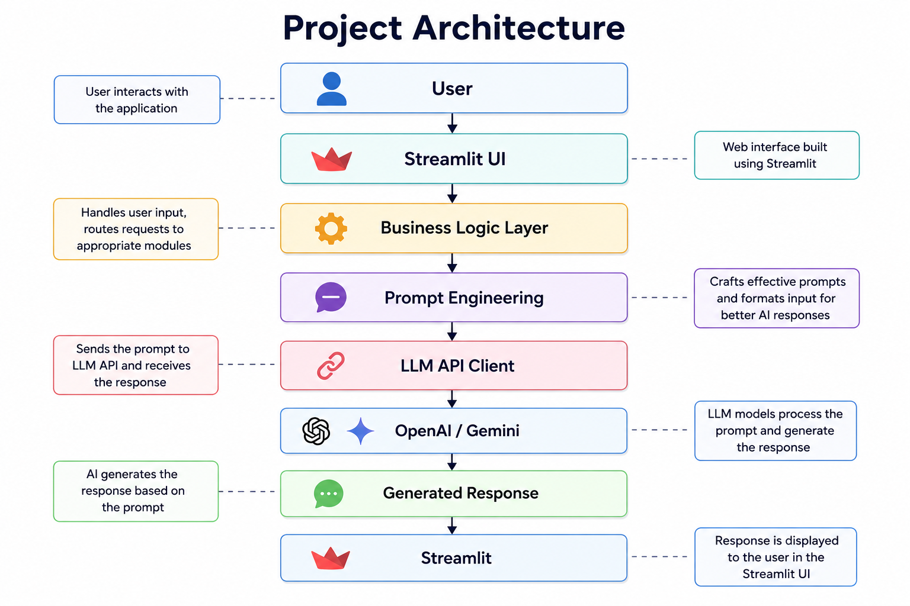

#  Personal AI Productivity & Automation Agent

<div align="center">


<br>

###  Your All-in-One AI Assistant for Productivity, Automation & Daily Work

Generate Emails • Summarize Documents • Create Meeting Notes • Plan Tasks • Generate Content • Rewrite Text • Summarize PDFs

<br>


</div>

---

#  Overview

**Personal AI Productivity & Automation Agent** is an AI-powered productivity application built using **Python**, **Streamlit**, and **Large Language Models (LLMs)**.

The project is designed to automate everyday professional tasks by leveraging Generative AI. It combines multiple AI-powered tools into one application, helping users save time, improve productivity, and streamline daily workflows.

The application follows a modular architecture, making it scalable, maintainable, and easy to extend with new AI capabilities.

---

#  Features

- 📧 AI Email Generator
- 📩 Email Summarizer
- 📝 Meeting Notes Generator
- 📅 Smart Task Planner
- ✍️ AI Content Creator
- 🔤 Grammar & Rewrite Assistant
- 📄 PDF Notes Summarizer
- 🧠 Prompt Engineering Templates
- ⚡ Groq LLM Integration
- 🎨 Modern Streamlit Interface
- 🔧 Modular Service Architecture
- 🚀 Fast AI Responses

---

#  Project Architecture

The application follows a clean layered architecture where every component has a dedicated responsibility.

<div align="center">



</div>

### Architecture Flow

```
User
   │
   ▼
Streamlit UI
   │
   ▼
Business Logic Layer
   │
   ▼
Prompt Engineering
   │
   ▼
LLM Service
   │
   ▼
Groq API
   │
   ▼
AI Response
   │
   ▼
Formatter
   │
   ▼
Final Output
```

---

#  Core Modules

###  Email Generator

Generate professional emails instantly based on user requirements.

---

###  Email Summarizer

Summarize long emails into concise and actionable points.

---

###  Meeting Notes Generator

Convert meeting discussions into well-structured meeting notes.

---

###  Smart Task Planner

Create organized daily or weekly task plans using AI.

---

###  Content Creator

Generate blogs, captions, articles, social media posts, and more.

---

###  Grammar & Rewrite Assistant

Improve grammar, rewrite sentences, and enhance writing quality.

---

###  PDF Notes Summarizer

Upload PDF documents and generate concise AI-powered summaries.

---

#  Tech Stack

| Category | Technology |
|----------|------------|
| Programming Language | Python |
| Frontend | Streamlit |
| AI Model | Groq LLM |
| Prompt Engineering | Custom Prompt Templates |
| Backend | Python |
| API Integration | Groq API |
| Environment | Virtual Environment |
| Version Control | Git & GitHub |
| Deployment | Streamlit Cloud |

---

#  Project Structure

```
Personal_AI_Productivity_Chatbot/

│
├── app.py
├── requirements.txt
├── README.md
│
├── assets/
│   ├── banner.png
│   └── architecture.png
│
├── pages/
│
├── services/
│
├── prompts/
│
├── llm/
│
├── utils/
│
└── components/
```

---

#  Installation

Clone the repository

```bash
git clone https://github.com/YOUR_USERNAME/Personal_AI_Productivity_Chatbot.git
```

Move into the project

```bash
cd Personal_AI_Productivity_Chatbot
```

Create a virtual environment

```bash
python -m venv venv
```

Activate the virtual environment

### Windows

```bash
venv\Scripts\activate
```

### macOS/Linux

```bash
source venv/bin/activate
```

Install dependencies

```bash
pip install -r requirements.txt
```

Run the application

```bash
streamlit run app.py
```

---

#  Environment Variables

Create a **.env** file inside the project directory.

```env
GROQ_API_KEY=your_groq_api_key
```

---

#  Future Enhancements

- 🎙️ Voice Assistant Integration
- 📅 Google Calendar Integration
- 📧 Gmail Integration
- 📱 WhatsApp Automation
- 🧠 Memory-enabled AI Assistant
- 📚 RAG-based Knowledge Assistant
- 🔗 LangChain Integration
- 🗄️ Vector Database Support
- 👥 Multi-Agent Collaboration
- 🌐 Multi-Model Support (OpenAI, Gemini, Claude)

---

#  Learning Outcomes

This project demonstrates practical knowledge of:

- Generative AI
- Prompt Engineering
- Large Language Models
- Python Development
- Streamlit
- API Integration
- Software Architecture
- Modular Programming
- AI Workflow Automation
- User Interface Design

---

#  Contributing

Contributions are always welcome!

If you would like to improve this project:

1. Fork the repository
2. Create a new feature branch
3. Commit your changes
4. Push your branch
5. Open a Pull Request

---

#  Support

If you found this project helpful, consider giving it a **⭐ Star** on GitHub.

It motivates future improvements and helps others discover the project.

---

#  License

This project is licensed under the **MIT License**.

Feel free to use, modify, and distribute it for educational and personal purposes.

---

#  Author

## Jovial Korivi

 B.Tech Computer Science & Engineering

 AI | Machine Learning | Generative AI | Python | Streamlit

🔗 **GitHub:** https://github.com/jovialkorivi-6713

🔗 **LinkedIn:** https://linkedin.com/in/jovialkorivi

---

<div align="center">

###  Transforming Productivity with the Power of Generative AI

**Built  using Python, Streamlit & Large Language Models**

</div>
